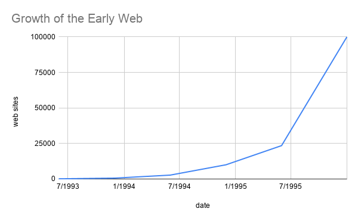

# HW# - Title
### Your Name
### CS 432, Fall 2022
### Due Date

# Q1

*You may copy the question into your report, but make sure that you make it clear where the question ends and your answer begins.*

## Answer

The example figure below shows the growth in the number of websites between 1993 and 1996.



*If you want to include code in your report, you can insert a screenshot (if it's legible), or you can copy/paste the code into a fenced code block.*

```python
#!/usr/local/bin/python3
# testargs.py

import sys

print ("{} is the name of the script." . format(sys.argv[0]))
print ("There are {} arguments: {}" . format(len(sys.argv), str(sys.argv)))

for ind, arg in enumerate(sys.argv):
    print ("[{}]: {} {}".format(ind,arg,sys.argv[ind]))
```

The table below shows a simple table.  

|Week|Date|Topic|
|:---|:---|:---|
|1|Sep 1, 3|Introduction, What's Vis and Why Do It?|
|2|Sep 8, 10|Data and Data Cleaning|
|3|Sep 15, 17|Marks and Channels|

The table below shows an example confusion matrix (you'll see this term later) from <https://en.wikipedia.org/wiki/Confusion_matrix>.

| | |Actual||
|---|---|---|---|
|**Predicted**| |Cat|Dog|
| |Cat|5 (TP)|3 (FP)|
| |Dog|2 (FN)|3 (TN)|

## Discussion

*You must provide some discussion of every answer. Discuss how you arrived at the answer and the tools you used. Discuss the implications of your answer.*

# Q2

## Answer

## Discussion

# Q3

## Answer

## Discussion

# References

*Every report must list the references that you consulted while completing the assignment. If you consulted a webpage, you must include the URL.*

* Insert Reference 1, <https://www.example.com>
* Insert Reference 2, <https://www.example.com/reallyreallyreally-extra-long-URI/>